

<picture><source media="(max-width: 600px)" srcset="https://raw.githubusercontent.com/Choi-Jungwoo/Choi-Jungwoo/main/assets/pixel/header-narrow.svg" /></picture>

<h3><picture><source media="(max-width: 600px)" srcset="https://raw.githubusercontent.com/Choi-Jungwoo/Choi-Jungwoo/main/assets/pixel/section-about-narrow.svg" />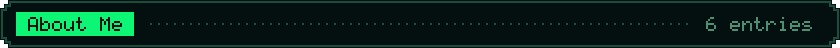</picture></h3>

- 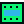 **Ex-NetEase Pipeline TD** — built VFX pipeline tooling & the **Rust × Autodesk Maya** ecosystem (bindgen, plugins, runtimes)
- 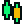 **Quant systems engineer** — building multi-market trading & arbitrage infrastructure
- 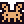 Polyglot engineer: **Rust · C#/.NET · Go · TypeScript · Python · C++**, from systems programming to full-stack products
- 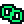 **Blockchain & fintech** — crypto exchange & prediction-market integrations, delta-neutral / statistical arbitrage, MT5 & CTP connectivity
-  **Security & reverse engineering** — antivirus tooling, native DLL interop, firmware tinkering
- 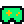 **Game dev** — Unreal Engine source licensee, Unity multiplayer games, Minecraft server ecosystems

<h3><picture><source media="(max-width: 600px)" srcset="https://raw.githubusercontent.com/Choi-Jungwoo/Choi-Jungwoo/main/assets/pixel/section-stack-narrow.svg" />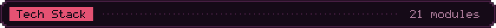</picture></h3>

<picture><source media="(max-width: 600px)" srcset="https://raw.githubusercontent.com/Choi-Jungwoo/Choi-Jungwoo/main/assets/pixel/stack-narrow.svg" />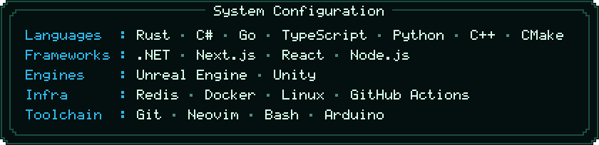</picture>

<h3><picture><source media="(max-width: 600px)" srcset="https://raw.githubusercontent.com/Choi-Jungwoo/Choi-Jungwoo/main/assets/pixel/section-exchanges-narrow.svg" />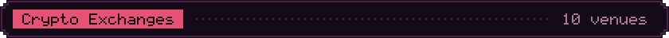</picture></h3>

<picture><source media="(max-width: 600px)" srcset="https://raw.githubusercontent.com/Choi-Jungwoo/Choi-Jungwoo/main/assets/pixel/exchanges-narrow.svg" />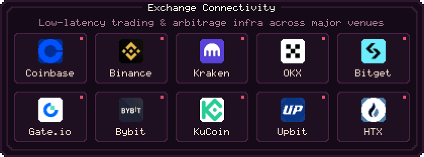</picture>

<h3><picture><source media="(max-width: 600px)" srcset="https://raw.githubusercontent.com/Choi-Jungwoo/Choi-Jungwoo/main/assets/pixel/section-projects-narrow.svg" />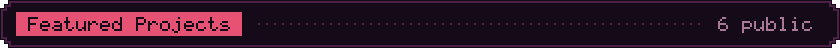</picture></h3>

>  Most of my production work lives in private repositories — quant trading infrastructure, game servers & internal tooling.

| Project | Description |
| :--- | :--- |
|  [**MayaX**](https://github.com/Choi-Jungwoo/MayaX) | Example runtime for Autodesk Maya — write Maya extensions in Rust |
|  [**maya-sys**](https://github.com/Choi-Jungwoo/maya-sys) | Maya C++ API bindgen — the foundation of the Rust × Maya ecosystem |
|  [**maya-poly-noise-rs**](https://github.com/Choi-Jungwoo/maya-poly-noise-rs) | Using Rust in Maya — procedural poly noise plugin example |
|  [**maya-rust-noise-plugin**](https://github.com/Choi-Jungwoo/maya-rust-noise-plugin) | Rust + C++ hybrid implementation of a Maya plugin |
|  [**demon**](https://github.com/Choi-Jungwoo/demon) | Multi-threaded download tool implemented in Rust |
|  [**fire-sensor-example**](https://github.com/Choi-Jungwoo/fire-sensor-example) | Embedded Rust — fire sensor example for NodeMCU |

<h3><picture><source media="(max-width: 600px)" srcset="https://raw.githubusercontent.com/Choi-Jungwoo/Choi-Jungwoo/main/assets/pixel/section-stats-narrow.svg" />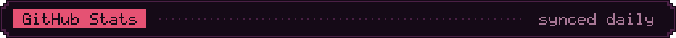</picture></h3>



<h3><picture><source media="(max-width: 600px)" srcset="https://raw.githubusercontent.com/Choi-Jungwoo/Choi-Jungwoo/main/assets/pixel/section-snake-narrow.svg" />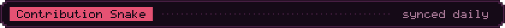</picture></h3>

<picture>
  <source media="(prefers-color-scheme: dark)" srcset="https://raw.githubusercontent.com/Choi-Jungwoo/Choi-Jungwoo/output/github-snake-dark.svg" />
  <source media="(prefers-color-scheme: light)" srcset="https://raw.githubusercontent.com/Choi-Jungwoo/Choi-Jungwoo/output/github-snake.svg" />
  
</picture>

  

<picture><source media="(max-width: 600px)" srcset="https://raw.githubusercontent.com/Choi-Jungwoo/Choi-Jungwoo/main/assets/pixel/footer-narrow.svg" />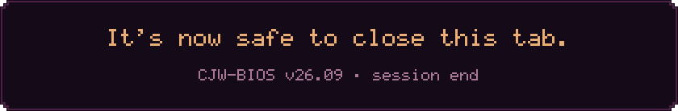</picture>

